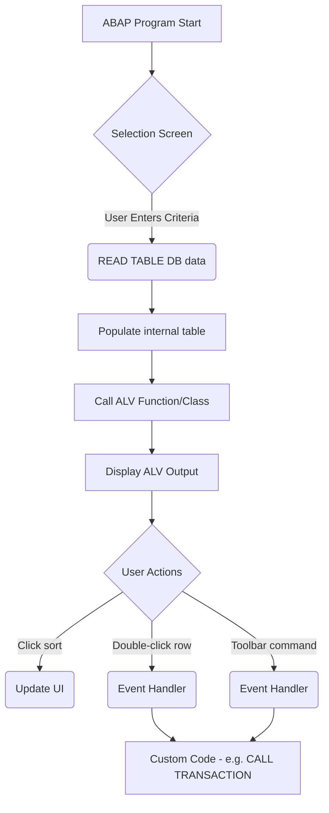
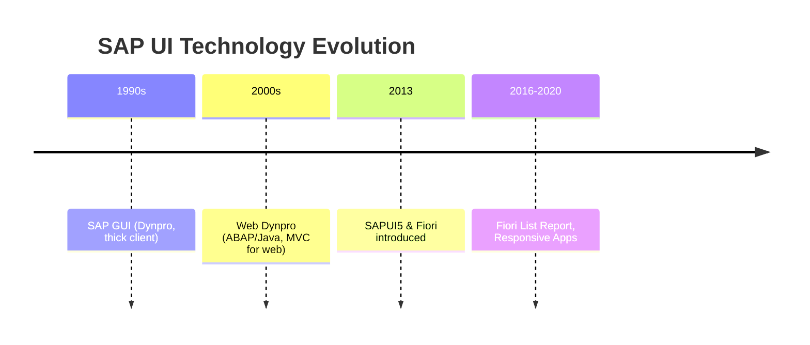

# ABAP List Viewer (ALV) – Comprehensive Guide

**Executive Summary:** This document provides an in-depth reference on the SAP ABAP List Viewer (ALV) – also known as SAP List Viewer – covering foundational concepts through advanced scenarios. ALV enables SAP developers to display tabular and hierarchical data interactively, with built-in features like sorting, filtering, subtotals, and exporting. This guide reviews classic ALV (function-module based), object-oriented ALV (ALV Grid and Tree), and the modern SALV (Simple ALV) model, including the HANA-optimized IDA (Integrated Data Access) variant. We compare ALV against other SAP data display technologies (classic lists, Web Dynpro, Fiori/UI5 tables, CDS/OData) and offer practical tutorials, code samples, diagrams, best practices, and troubleshooting tips. By the end, ABAP developers will have a thorough understanding of how to implement, customize, and optimize ALV output in SAP.

**Learning Objectives:** After studying this document, you should be able to:
- Understand ALV’s role in the SAP UI stack and its evolution.
- Identify ALV types (REUSE function modules, OO ALV Grid/Tree, SALV, SALV with IDA) and choose the appropriate approach.
- Create basic and advanced ALV reports using function modules (`REUSE_ALV_LIST_DISPLAY`, `REUSE_ALV_GRID_DISPLAY`), and classes (`CL_GUI_ALV_GRID`, `CL_SALV_TABLE`, etc.).
- Customize ALV output (field catalogs, layouts, variants, events, user commands).
- Implement ALV with editable cells, totals, and hierarchies.
- Use ALV in Web Dynpro or Fiori contexts (e.g., Web Dynpro ALV or Fiori List Report).
- Diagnose performance and memory issues (e.g., for large data sets) and apply solutions like Integrated Data Access (IDA).
- Apply best practices, naming conventions, and debugging strategies for ALV development.
- Compare ALV against alternative presentation layers (classic SAP lists, Web Dynpro tables, Fiori/UI5, CDS, OData) with respect to use-cases, performance, accessibility, and security.

**Prerequisites:** Readers should have intermediate knowledge of ABAP programming and SAP GUI concepts. Familiarity with ABAP reports, internal tables, data dictionary, and basic UI programming (screens, dynpros, or Web Dynpro) is expected. Understanding of SAP HANA/CAN DDL or CDS is helpful for advanced topics (ALV with IDA, CDS consumption), but not mandatory.

## Introduction to ALV

The **ABAP List Viewer (ALV)** – also called the **SAP List Viewer** – is a framework for presenting application data in lists or grids with interactive features. According to SAP, ALV is “an integrated element of the ABAP Objects programming environment” that allows developers to “quickly implement the display of structured datasets”【37†L15-L22】. In practice, ALV provides a uniform way to display tables, lists, and hierarchies, independent of the underlying tool (function module, control, or SALV). It offers end-users functionality like column sorting, filtering, subtotals, layout variants, and export to formats (Excel, PDF) out-of-the-box.

ALV evolved over SAP’s history. Classic ALV in SAP GUI used function modules (in the `REUSE_ALV_*` family) or OO grid controls (`CL_GUI_ALV_GRID`, `CL_GUI_ALV_TREE` with custom containers). In newer releases, **Simple ALV (SALV)** classes (e.g. `CL_SALV_TABLE`, `CL_SALV_HIERSEQ_TABLE`, `CL_SALV_GUI_TABLE_IDA`) simplify development by reducing boilerplate (no explicit field catalogs needed)【48†L42-L49】【58†L734-L743】. SALV also offers built-in event handling and easy layout features. With SAP HANA and ABAP 7.40+, **ALV with Integrated Data Access (IDA)** (`CL_SALV_GUI_TABLE_IDA`) addresses performance by streaming data from the database as needed rather than loading entire internal tables【58†L749-L758】.

Throughout this guide, we use examples and snippets to illustrate each ALV scenario. For brevity, code examples are shown in ABAP syntax blocks. Official SAP documentation and authoritative community sources are cited for key facts and API details.

## ALV Basics: Function Module Based (Classic ALV)

Classic ALV reports often use SAP’s standard function modules in the `REUSE_ALV_*` family. The two most common are `REUSE_ALV_LIST_DISPLAY` (for simple lists) and `REUSE_ALV_GRID_DISPLAY` (for grid controls). These require building a field catalog (structure defining columns) and passing an internal table of data.  

- **Simple ALV List (REUSE_ALV_LIST_DISPLAY):** Displays data in a list (non-grid) format. Used in older code or where grid features aren’t needed.  
- **ALV Grid (REUSE_ALV_GRID_DISPLAY):** Shows data in a grid (tree control). This is more modern, with toolbar buttons and functions for sort, filter, subtotal, etc. (Parameters are similar to the list function)【48†L71-L74】.

### Field Catalog

Before calling the ALV function module, you typically populate a *field catalog* (table `SLIS_T_FIELDCAT_ALV` or `LVC_T_FCAT`). Each row describes a column (field name, text, output length, data element attributes, hot spots, etc.). SAP provides utility functions (`REUSE_ALV_FIELDCATALOG_MERGE`) to auto-generate a field catalog from a DDIC structure or internal table.

**Example:** Basic ALV grid display  
```abap
REPORT z_alv_simple.

TYPE-POOLS: slis.  " include SLIS for field catalog types

DATA: lt_sflight TYPE TABLE OF sflight,
      ls_fcat    TYPE slis_fieldcat_alv,
      lt_fcat    TYPE slis_t_fieldcat_alv.

*-- Fetch data into internal table lt_sflight
SELECT * FROM sflight INTO TABLE lt_sflight.

*-- Build field catalog manually (or via merge)
ls_fcat-fieldname = 'CARRID'.  " field of lt_sflight
ls_fcat-seltext_m = 'Airline'.
APPEND ls_fcat TO lt_fcat.
CLEAR ls_fcat.
ls_fcat-fieldname = 'CONNID'.
ls_fcat-seltext_m = 'Flight No.'.
APPEND ls_fcat TO lt_fcat.
* ... add other fields similarly ...

*-- Call ALV Grid function module
CALL FUNCTION 'REUSE_ALV_GRID_DISPLAY'
  EXPORTING
    i_structure_name = 'SFLIGHT'
    it_fieldcat      = lt_fcat
  TABLES
    t_outtab         = lt_sflight
  EXCEPTIONS
    program_error    = 1
    OTHERS           = 2.
IF sy-subrc <> 0.
  MESSAGE 'ALV display failed' TYPE 'I'.
ENDIF.
```
This simple report shows data from table SFLIGHT. The field catalog describes which fields and labels to use. The `REUSE_ALV_GRID_DISPLAY` call opens the ALV in the current screen. Note that the result is an ABAP list formatted into the ALV grid (no custom screen needed).

Table: **ALV Function Modules Summary**【48†L42-L49】  
| Function Module             | Purpose                                         |
|-----------------------------|-------------------------------------------------|
| `REUSE_ALV_LIST_DISPLAY`    | Display an ALV list (non-grid list).            |
| `REUSE_ALV_GRID_DISPLAY`    | Display an ALV grid (with context menu, toolbar). |
| `REUSE_ALV_COMMENTARY_WRITE`| Output list header/commentary information.       |
| `REUSE_ALV_VARIANT_F4`      | Show variant (layout) selection dialog.          |
| `REUSE_ALV_VARIANT_EXISTENCE` | Check if an ALV variant exists.               |
| `REUSE_ALV_FIELDCATALOG_MERGE` | Create field catalog from DDIC structure/table.|

**Resource:** In a community tutorial, the steps to create an ALV report via `REUSE_ALV_LIST_DISPLAY` are shown, including defining selection screens, structures, and fetching data【44†L216-L220】. After coding, the result is an interactive list where users can sort/filter columns via the standard ALV toolbar.

### Interactive Features

By default, ALV provides column sorting, filtering, summation (under context menu), and variant management (saving layouts). You can control these via parameters (passing layout tables, etc.) and setting fields in the field catalog (e.g., `checkbox = 'X'` to make a column a checkbox). Classic ALV also allows event handling via callback routines (`i_callback_user_command` for custom button actions, etc.).

**Key Point:** In classic ALV, **all data must fit into an internal table** at once, because the output is rendered after selection screen processing. This can be memory-intensive for very large datasets. (Later, ALV with IDA addresses this.)

## Object-Oriented ALV (ALV Grid and Tree)

SAP provides OO classes for ALV display, primarily in the `CL_GUI_ALV_*` family. These require an SAPGUI control container. This model is often called “ALV Grid Control” and offers more flexibility (especially when embedding ALV in screens with other controls).

### CL_GUI_ALV_GRID

`CL_GUI_ALV_GRID` is the main class for creating an ALV grid control. You instantiate it with a container (e.g. full screen or custom container) and call its `SET_TABLE_FOR_FIRST_DISPLAY` method.

**Basic Steps (Full-Screen ALV):**
1. In an ABAP report, define a custom container or use the default screen.
2. Create an ALV grid object and pass the container:
   ```abap
   DATA(lo_grid) = NEW cl_gui_alv_grid(
     i_parent = cl_gui_container=>default_screen
   ).
   ```
3. Provide data and optional layout or field catalog, e.g.:
   ```abap
   lo_grid->set_table_for_first_display(
     EXPORTING
       i_structure_name = 'SBOOK'
     CHANGING
       it_outtab        = lt_sbook
   ).
   ```
4. Display by calling `CALL SCREEN 100` where screen 100 is empty (contains only custom container or no elements, since we used `default_screen`)【9†L53-L61】.

```abap
REPORT z_alv_grid_demo.

DATA: lt_sbook TYPE TABLE OF sbook.

* Fetch data
SELECT * FROM sbook INTO TABLE lt_sbook.

* Create ALV grid object (full screen container)
DATA(lo_grid) = NEW cl_gui_alv_grid(
  i_parent = cl_gui_container=>default_screen
).

* Display the data in ALV grid (no field catalog needed if using i_structure_name)
TRY.
    lo_grid->set_table_for_first_display(
      EXPORTING
        i_structure_name = 'SBOOK'
      CHANGING
        it_outtab        = lt_sbook
    ).
  CATCH cx_root.
    MESSAGE 'Error displaying ALV' TYPE 'E'.
ENDTRY.
CALL SCREEN 100.
```
**Resource:** An SAP blog shows exactly this minimal code to use `CL_GUI_ALV_GRID` without a container definition, relying on the default screen【9†L53-L61】. It results in a full-screen ALV grid when run, provided the program has a screen (e.g. 0100) with no custom container.

**Custom Containers:** If your screen 0100 (or screen of choice) has a custom container element (from Screen Painter, type `Container`), use `NEW cl_gui_alv_grid( i_parent = <custom container> )`. This embeds ALV inside your Dynpro layout, coexisting with other UI elements.

**Toolbar and Menus:** `CL_GUI_ALV_GRID` automatically shows the ALV toolbar with functions (Sort, Layout, Print, etc.). You can programmatically add or remove functions via `lo_grid->register_edit_event( ...)` or `lo_grid->set_pfstatus`.

### Events and Editing

The `CL_GUI_ALV_GRID` class raises events for user actions. For example:
- **Double Click:** Handle with `FOR EVENT double_click OF cl_gui_alv_grid`, callback receives row/column.  
- **Hotspot Click:** Mark a field as hotspot in field catalog (`hotspot = 'X'`), handle via `FOR EVENT hotspot_click`.  
- **Toolbar/User Functions:** Handle with `FOR EVENT toolbar OF cl_gui_alv_grid` or catch menu commands.

_Sample (pseudocode)_:
```abap
CLASS lcl_event_handler DEFINITION.
  PUBLIC SECTION.
    CLASS-METHODS handle_double_click
      FOR EVENT double_click OF cl_gui_alv_grid
      IMPORTING e_row e_column.
ENDCLASS.

CLASS lcl_event_handler IMPLEMENTATION.
  METHOD handle_double_click.
    MESSAGE |Double clicked row { e_row } col { e_column }| TYPE 'I'.
  ENDMETHOD.
ENDCLASS.

" ... after creating lo_grid:
DATA lo_evt TYPE REF TO cl_gui_alv_events.
lo_evt = lo_grid->get_event( ).
SET HANDLER lcl_event_handler=>handle_double_click FOR lo_evt.
```
When the user double-clicks, the handler runs. (In a real app, you might navigate to another transaction or detail screen.)

### Editable ALV Grid

By default, CL_GUI_ALV_GRID displays read-only tables. To make cells editable:
- Set `edit = 'X'` in the field catalog entries for columns.
- After `set_table_for_first_display`, call `lo_grid->register_edit_event( if_salv_c_event_id=>data_changed )`.
- Handle the `data_changed` event (`IF_SALV_C_EVENT_ID` in SALV or `CL_GUI_ALV_GRID=>` event) to capture changes.

**Note:** Editable ALV is complex and discouraged for new projects; SAP does not provide a simple direct API for it in SALV. One blog describes reverse-engineering SALV internals to make SALV editable【37†L42-L44】【37†L68-L76】. In practice, for editable grids consider using Web Dynpro with editable columns or SAPUI5 input table in Fiori.

### ALV Tree Control (CL_GUI_ALV_TREE)

For multi-level (parent-child) hierarchies in SAP GUI, use `CL_GUI_ALV_TREE`. This class works similarly to ALV Grid but allows adding nodes programmatically.

**Example concept:** Building a tree ALV of airlines and their flights. Using data from SCARR (carrier) and SPFLI (flight connections):

```abap
DATA: lr_cust TYPE REF TO cl_gui_custom_container,
      lr_tree TYPE REF TO cl_gui_alv_tree,
      lt_scarr TYPE TABLE OF scarr,
      lt_spfli TYPE TABLE OF spfli,
      ls_header TYPE treev_hhdr.

* Fetch airline and flights
SELECT * FROM scarr INTO TABLE lt_scarr.
IF lt_scarr IS NOT INITIAL.
  SELECT * FROM spfli INTO TABLE lt_spfli FOR ALL ENTRIES IN lt_scarr
    WHERE carrid = lt_scarr-carrid.
ENDIF.

* Create a custom container on screen 100 (assume container name 'ALV_TREE')
CREATE OBJECT lr_cust
  EXPORTING container_name = 'ALV_TREE'
            repid          = sy-repid
            dynnr          = sy-dynnr.

* Create tree ALV in that container
CREATE OBJECT lr_tree
  EXPORTING parent         = lr_cust
            node_selection_mode = cl_gui_column_tree=>node_sel_mode_single
            item_selection      = 'X'.

* Set initial display structure (table heading)
ls_header-heading = 'Flight Information'.
ls_header-tooltip = 'Flight Data'.
ls_header-width   = 40.

CALL METHOD lr_tree->set_table_for_first_display
  EXPORTING
    i_structure_name    = 'SPFLI'
    is_hierarchy_header = ls_header
  CHANGING
    it_outtab           = lt_spfli.

* Add root node for carriers
DATA(lv_root_key) = ''.
CALL METHOD lr_tree->add_node
  EXPORTING
    i_relat_node_key = lv_root_key
    i_relationship   = cl_gui_column_tree=>relat_last_child
    i_node_text      = 'Airlines'
  IMPORTING
    e_new_node_key   = lv_root_key.

* Add child nodes: one node per airline
LOOP AT lt_scarr INTO DATA(ls_carr).
  DATA(lv_node_key1) TYPE lvc_nkey.
  CALL METHOD lr_tree->add_node
    EXPORTING
      i_relat_node_key = lv_root_key
      i_relationship   = cl_gui_column_tree=>relat_last_child
      i_node_text      = ls_carr-carrid
    IMPORTING
      e_new_node_key   = lv_node_key1.
  " Optionally store lv_node_key1 somewhere

  " Now add flights under this airline
  LOOP AT lt_spfli INTO DATA(ls_flight) WHERE carrid = ls_carr-carrid.
    CALL METHOD lr_tree->add_node
      EXPORTING
        i_relat_node_key = lv_node_key1
        i_relationship   = cl_gui_column_tree=>relat_last_child
        is_outtab_line   = ls_flight
      IMPORTING
        e_new_node_key   = DATA(lv_node_key2).
  ENDLOOP.
ENDLOOP.
```

The code above (from a blog example【53†L18-L25】【53†L99-L104】) creates a tree control with a root “Airlines” node, then children (one per `carrid`), and under each, leaf nodes from the SPFLI table. The `set_table_for_first_display` call binds the SPFLI table to the tree (for data columns), and `add_node` inserts hierarchical levels.

## SALV (Simple ALV) Model

The **Simple ALV (SALV)** classes introduced in NetWeaver 7.x greatly simplify ALV usage. You do not manually build a field catalog; SALV introspects an internal table. It provides a builder/factory method and fluent OO interface for customizing layout and events.

### CL_SALV_TABLE (Grid SALV)

`CL_SALV_TABLE` is the SALV class for simple table (grid) output. Usage pattern:
```abap
DATA(lo_salv) = NEW cl_salv_table( ).

TRY.
    " Create SALV object with data
    CALL METHOD cl_salv_table=>factory
      IMPORTING r_salv_table = lo_salv
      CHANGING t_table = lt_data.
  CATCH cx_salv_msg.
    " handle errors
ENDTRY.

* Display ALV
lo_salv->display( ).
```
Internally, SALV builds a field catalog from the data dictionary of `lt_data` or from column names. It then shows the grid similar to CL_GUI_ALV_GRID.

**Example:**
```abap
REPORT z_alv_simplest.

DATA: lt_spfli TYPE TABLE OF spfli.

* Load data
SELECT * FROM spfli INTO TABLE lt_spfli.

* Create SALV table
DATA(lo_salv) TYPE REF TO cl_salv_table.
TRY.
    CALL METHOD cl_salv_table=>factory
      IMPORTING
        r_salv_table = lo_salv
      CHANGING
        t_table      = lt_spfli.
    " Customizations can go here before display
    lo_salv->display( ).
  CATCH cx_salv_msg INTO DATA(lx_salv).
    MESSAGE lx_salv->get_text( ) TYPE 'E'.
ENDTRY.
```
This automatically shows all columns of SPFLI. No screen or container needed – it uses full screen and default ALV toolbar. An instructor blog explicitly notes that with SALV you don’t need to manually build a field catalog or container【13†L29-L36】.

After creation and before `display()`, SALV allows many customizations via getters:

- **Layout:** `lo_salv->get_layout( )` returns a layout object. You can `set_striped_pattern`, `set_grid_width()`, etc.
- **Columns:** `lo_salv->get_columns( )` to access `cl_salv_columns_table`. Then `get_column('FIELDNAME')` and adjust short text, visibility, hotspot, color, F4, etc【13†L85-L94】【13†L179-L184】.
- **Aggregations:** `lo_salv->get_aggregations( )` and `add_aggregation( columnname, aggregation )` to add sum/avg columns at top or bottom【13†L118-L125】.
- **Events:** `lo_salv->get_event( )` returns an events object. You register handlers similar to the GUI ALV (but SALV events are static/class-based, e.g., `FOR EVENT double_click OF cl_salv_events_table`【13†L129-L137】).

   For instance, to handle double-click on a SALV row:
   ```abap
   DATA(lo_events) = lo_salv->get_event( ).
   SET HANDLER zcl_event_handler=>on_double_click FOR lo_events.
   ...
   CLASS zcl_event_handler DEFINITION.
     PUBLIC SECTION.
       CLASS-METHODS on_double_click
         FOR EVENT double_click OF cl_salv_events_table
         IMPORTING row column.
   ENDCLASS.
   CLASS zcl_event_handler IMPLEMENTATION.
     METHOD on_double_click.
       " e.g. call another transaction using the data
     ENDMETHOD.
   ENDCLASS.
   ```
   (See sample in 【13†L129-L137】.)

- **Context Menus:** SALV provides predefined functions (IF_SALV_C_FUNCTIONS) like sort, find, etc. Use `lo_salv->set_screen_status( report = sy-repid pfstatus = '...' set_functions = lo_salv->c_functions_all )` to assign a custom GUI status (toolbar/buttons)【13†L38-L46】.
- **Layout Variants:** SALV supports saving and loading layouts (using `cl_salv_layout_service`). Code example sets default layout or F4 help on layout field【13†L49-L57】.

**Important:** By design, SALV tables are **not editable**. As one blog states, “The official statement about using the CL_SALV_TABLE object is: ‘Tables displayed with ALV are not ready for input’”【37†L42-L44】. While workarounds exist, for editable grids SALV alone isn’t sufficient.

### CL_SALV_HIERSEQ_TABLE (Hierarchical Sequential SALV)

This SALV class handles parent-child hierarchies. You prepare an internal table with hierarchical numbering (e.g. holding a parent-child key and indent levels), and SALV will display it as collapsible rows. It requires two internal tables: one for header and one for items, linked by a “child table”. Usage is more complex and less common, so details are skipped for brevity.

### ALV with IDA (HANA Optimized)

**ALV with Integrated Data Access (IDA)** is a special ALV introduced in ABAP 7.40/7.50 for HANA systems【58†L707-L715】【58†L749-L758】. Instead of pre-loading all data, it fetches only a screenful of rows and pushes sorting/filtering down to the HANA database for performance. It uses class `CL_SALV_GUI_TABLE_IDA` and can even consume CDS views directly.

Key points about ALV IDA【58†L749-L758】:
- No internal table holds all data in ABAP memory. Only visible rows are fetched at any time.
- Scrolling or paging triggers new DB fetches. (If the table has 1,000,000 rows, only ~n rows (screen size) are in memory at once.)
- Operations like sorting, totaling, and grouping are performed by HANA (code pushdown), greatly improving speed.
- From a user perspective, ALV IDA looks the same as classic ALV (same toolbar, keyboard shortcuts)【58†L767-L774】.
- Example usage: `CALL METHOD cl_salv_gui_table_ida=>create_for_cds_view( EXPORTING iv_table_name = 'YOUR_CDS_VIEW' IMPORTING r_salv_table = lo_salv )`.

In summary, **performance** for extremely large data sets is much better with IDA. Traditional ALV (“classical ALV”) loads the entire internal table and then does ABAP-side processing【58†L749-L758】. IDA should be used when working with millions of records on HANA to avoid memory overflows and slow navigation.

## Advanced ALV Topics

### Editable ALV

As noted, by default SALV and classic ALV grids are read-only. To allow user editing of data in an ALV:
- **CL_GUI_ALV_GRID:** You can mark columns as editable and handle the `data_changed` event. This requires using the field catalog (`edit = 'X'` on the LVC_FCAT) and event handlers. It’s possible but non-trivial (see SAP notes or community blogs).  
- **SALV hack:** Some developers achieve edit-in-ALV by retrieving the underlying CL_GUI_ALV_GRID from a SALV instance (via its controller) and then enabling edit on the field catalog【37†L68-L77】【37†L98-L106】. This is advanced and not officially supported.
- **Alternate:** For editable tables, consider SAPUI5/Fiori (where tables support input fields) or Web Dynpro with table UI elements.

### Sorting, Filtering, and Totals

ALV provides built-in sorting and filtering via the user interface (column filter icon and sort arrows). Developers can predefine sort or filter conditions by passing layout variant or carrying out a sort before passing to ALV.

For **totals/subtotals**:
- In classic ALV, you can sum columns by pressing the “Subtotal” button, or define a callback `EXPERT = 'X'` or an event in `REUSE_ALV_*` for custom summation.  
- In SALV, use `cl_salv_aggregations`. For example:
  ```abap
  DATA(lo_aggr) = lo_salv->get_aggregations( ).
  lo_aggr->add_aggregation( columnname = 'VOLUM' aggregation = if_salv_c_aggregation=>average ).
  lo_aggr->set_aggregation_before_items( ).
  ```
  (This was illustrated in a blog【13†L118-L125】.)  

Filtering programmatically can be done by constructing a field catalog filter in the SALV or by pre-filtering the internal table using ABAP (using `FILTER`, `SELECT-OPTIONS`, or `LOOP AT` to build a subset).

### ALV Event Flow

Below is a simplified event flow for an ALV report (this can be depicted with a mermaid flowchart):



This outlines that after data retrieval, ALV is called to render. Then any user interaction (sort/filter, double-click, custom button) is either handled by ALV itself or passed to developer code via events/handlers.

### ALV in Web Dynpro and Fiori

- **Web Dynpro (ABAP):** ALV can be used in Web Dynpro via `CL_SALV_WD_TABLE` (WD ALV) or by embedding a CL_GUI_ALV_* control in a Web Dynpro window (though the latter is less common). WD ALV uses a model-driven approach; refer to [SAP Help](https://help.sap.com/viewer/157de1dcd6594e32af7c1e21aa522c4e/7.52.5/en-US/4ec38f8788d22b90e10000000a42189d.html) for details.  
- **SAP Fiori/UI5:** Fiori apps use SAPUI5 controls (e.g. `sap.ui.table.Table` or `sap.m.Table`) bound to OData or CDS data sources. There isn’t a “classic ALV” in Fiori – instead, Fiori List Report templates (Smart Table) or custom tables offer similar functionality. For example, a CDS view can be annotated and published as an OData service; an SAPUI5 table can then consume it with live sorting/filtering. Fiori provides responsive design, mobile support, and accessibility improvements over ALV.  

Diagram: SAP UI Evolution Timeline  


## Performance and Memory Considerations

**Data Volume:** ALV (classic and SALV) loads all data into an internal table on the application server before display. Thus, large volumes (millions of rows) can cause runtime errors (e.g. `MESSAGE_TYPE_X`) or performance issues【58†L749-L758】. If the internal table is huge, the ABAP memory (PDA) may exhaust.

**Guidelines:**  
- Use restrictive `WHERE` clauses and `SELECT-OPTIONS` to fetch only needed data.  
- Avoid `SELECT *` on large tables without filters.  
- Consider using *paged data retrieval* (fetch in blocks) if you must process large sets.  
- Always clear or `FREE` internal tables not needed to free memory.  

**ALV with IDA:** On HANA systems, use ALV IDA classes (`CL_SALV_GUI_TABLE_IDA`) to leverage HANA pushdown and streaming. As cited, IDA ALV “only fetches the data to be shown on the screen at any given instant”【58†L749-L758】. This dramatically reduces memory footprint. IDA ALV also uses the `CREATE_FOR_CDS_VIEW` method to bind directly to CDS, further optimizing data access.

**Paging/Buffering:** In older systems, the ALV Grid has parameters like `i_buffer_active` (in function modules) or `set_table_for_first_display( i_bypassing_buffer = 'X' )` to force re-query or use a buffer. These have limited use. The real solution is to filter more or use IDA.

**Frontend Rendering:** Very large ALV outputs can also be slow to render on the client. Consider limiting visible rows or using the ALV layout to show totals only.

## Transport and Deployment

ALV reports and classes are transported like any ABAP development object (via SE80/development package). There is no separate “ALV configuration” object; variants (user-specific layouts) are stored per user or globally in table LVC*. When moving systems, only code goes via transport.

For Fiori/UI5 or Web Dynpro, the deployment path differs (e.g. transport of BSP applications or WD configurations). Those are outside ALV scope.

**Important:** If customizing an ALV program’s screen (e.g. adding a custom container in screen painter), ensure the screen is included in a development class/package.

## Testing and Debugging

- **Debug ALV Programs:** Set breakpoints in the START-OF-SELECTION or END-OF-SELECTION where you build data. For CL_GUI_ALV_GRID, you may need to place breakpoints inside event handler methods. For SALV, the handlers are static methods – set break in them.  
- **Event Debugging:** Use `SET USER-COMMAND` to simulate button clicks in test code.  
- **GET_GLOBALS_FROM_SLVC_FULLSCR:** In SALV, to retrieve the underlying ALV grid object (for example, to get selected rows), call the static function `GET_GLOBALS_FROM_SLVC_FULLSCR` to get a `cl_gui_alv_grid` reference. This allows calling grid methods that SALV normally abstracts away.  

## Common Errors and Fixes

- **“No container created” dump:** Occurs when using `CL_GUI_ALV_GRID` without an appropriate container. Fix: ensure `CREATE OBJECT cl_gui_custom_container` on screen or use `default_screen`.  
- **“Object not bound” or CX_SALV_MSG:** In SALV, if `factory` fails, catch `CX_SALV_MSG` and inspect `get_text( )`. Often due to missing authorizations or wrong parameter values.  
- **Field Catalog Mismatch:** Error if field catalog entries reference nonexistent fields. Always align field names with internal table.  
- **Memory Shortage (`SAPRABAX_SHORTAGE`):** Too much data loaded. Solution: filter data, use IDA, or increase memory (not preferred).  
- **Sorting by Number/Text:** In ALV Grid, numeric fields sort as numbers by default; ensure type compatibility. Use `OUTPUTLEN` in field catalog to format.  

## Best Practices and Naming Conventions

- **Class/Function Naming:** Use SAP naming conventions (Z* for custom). E.g. program `ZPROGRAM_ALV`, class `ZCL_MATNR_HELPER`.  
- **Use SALV for New Developments:** Prefer SALV (`CL_SALV_TABLE`) for simple tabular output in modern code – it reduces boilerplate (no explicit fieldcat) and improves maintainability【13†L29-L36】.  
- **Encapsulate ALV in Classes:** For OO design, wrap ALV logic in methods or classes rather than writing all code in a report. This aids testing and reuse.  
- **Variant Handling:** Use `IF_SALV_C_LAYOUT_SERVICE` to handle user layouts. Provide default layouts via parameters for user convenience (as in【13†L62-L70】).  
- **Performance:** Always try to push filtering to database (`WHERE` clauses), use proper SELECT statements (avoid nested SELECTs inside loops when possible).  
- **PF-Status:** Use meaningful PF-STATUS names (e.g. `ZALV_STD` for standard ALV status). Attach standard SALV functions via `set_functions = lo_salv->c_functions_all`.  
- **Language Translation:** Provide column header texts (`short_text`) to allow translation.  
- **Field Catalog vs SALV:** Remember SALV auto-creates field catalog from dictionary metadata. To hide columns in SALV, use `lo_columns->set_visible( if_salv_c_bool_sap=>false )`.  

## Examples and Exercises

1. **Basic ALV with REUSE_FM:** Create an ALV using `REUSE_ALV_GRID_DISPLAY` to list all materials (`MARA`) with fields `MATNR`, `MAKTX`, `MTART`. Include a selection screen for material type (`MATKL`). *Solution:* Fetch data into internal table, build field catalog (or use `REUSE_ALV_FIELDCATALOG_MERGE`), and call `REUSE_ALV_GRID_DISPLAY` with `i_callback_program = sy-repid`.  
2. **SALV Table with Event:** Use `CL_SALV_TABLE` to display sales orders. Set one column as hyperlink and handle the link-click event to navigate to `VA03` for that order. *Hint:* Use `lo_columns->set_cell_type( if_salv_c_cell_type=>hotspot )` and handle `if_salv_events_table=>link_click`.  
3. **Editable Grid:** (Challenge) Create a CL_GUI_ALV_GRID report showing material stocks. Make the “Quantity” column editable and trap changes via the `data_changed` event (if feasible). *Guidance:* Use `edit = 'X'` in field catalog and `register_edit_event`.  
4. **Web Dynpro ALV:** (Bonus) In a Web Dynpro ABAP application, embed an ALV table UI element bound to an ABAP context node of table type (e.g., VBAP). Make sure the component interface exposes any needed methods or attributes.

## Quick Reference – ALV APIs

| Object/Function         | Type        | Key Methods/Parameters                      | Notes                   |
|------------------------|-------------|---------------------------------------------|-------------------------|
| `REUSE_ALV_LIST_DISPLAY` | Function Module | i_structure_name (DDIC table/view name)<br>i_callback_program<br>it_fieldcat (if not using structure) | Classic ALV list. |
| `REUSE_ALV_GRID_DISPLAY` | Function Module | i_structure_name or it_fieldcat, i_callback_program,<br>it_outtab (data table) | Classic ALV grid. |
| `CL_GUI_ALV_GRID`      | Class       | constructor `(i_parent = <container>)`<br>`->set_table_for_first_display( i_structure_name / it_fieldcat, it_outtab )`<br>`->register_edit_event`, `->get_selected_rows` | Requires container (custom or default screen). |
| `CL_GUI_ALV_TREE`      | Class       | constructor `(parent = <container>)`<br>`->set_table_for_first_display( i_structure_name, is_hierarchy_header, it_outtab )`<br>`->add_node` | Build hierarchical ALV. |
| `CL_SALV_TABLE`        | Class       | `=>factory( IMPORTING r_salv_table CHANGING t_table )`<br>`->display( )`<br>`->get_columns( )->get_column(field)->set_short_text(...)`<br>`->get_layout( )->set_striped_pattern( )` | Simplest ALV, no explicit fieldcat. |
| `CL_SALV_HIERSEQ_TABLE`| Class       | Similar to CL_SALV_TABLE but for parent-child lists. | For hierarchical-sequential lists. |
| `CL_SALV_GUI_TABLE_IDA` | Class       | `=>create( EXPORTING iv_table_name = <string> [io_container] IMPORTING r_salv_table )`<br>`=>create_for_cds_view( iv_table_name = <CDS> ...)` | IDA ALV; data streaming on HANA. |
| `LVC_S_FCAT`           | Structure   | Field catalog line (used by CL_GUI_ALV_GRID) with fields: FIELDNAME, REF_TABLE/FIELD, COL_POS, OUTPUTLEN, HOTSPOT, EDIT, ... | Use table `LVC_T_FCAT` for multiple lines. |
| `IF_SALV_C_FUNCTIONS`  | Constants   | `c_functions_all`, `c_functions_no_entry` | Constants to set SALV toolbar functions. |
| `IF_SALV_C_BOOL_SAP`    | Constants   | `true`, `false` ('X'/' ') | SALV uses these for boolean settings. |
| `IF_SALV_C_LAYOUT`     | Constants   | `restrict_none`, `restrict_change` | For SALV layout save restrictions. |

## ALV vs. Other SAP Display Options

| Technology             | Pros                                                  | Cons                                             | Use Cases                              | Performance           | Accessibility     | Security Considerations               |
|-----------------------|-------------------------------------------------------|--------------------------------------------------|----------------------------------------|----------------------|-------------------|--------------------------------------|
| **ABAP List (WRITE)** | Very simple; no additional frameworks; full keyboard shortcuts.  | No interactivity (no sorting/filtering); manual formatting; not user-friendly. | Quick and dirty reports, system logs.   | Fast for small data; no overhead.  | Basic text (accessibility limited). | SAP GUI security (user auth on program). |
| **Classic ALV (GUI)** | Rich interactive features (sort, filter, export); known to power users【20†L609-L614】. Many built-in functions. | Loads entire data; requires SAP GUI; not mobile-friendly. | Complex data reports on SAP GUI.      | Can be slow with huge data (uses app server memory)【58†L749-L758】. | SAP GUI table accessible? Limited (no web features). | Same SAP auth as program. |
| **CL_GUI_ALV_TREE**   | Hierarchical display in SAP GUI; nodes and drilldown. | More complex coding; still SAP GUI only.         | Data with parent-child (e.g. BOM display). | Similar to ALV grid; app memory.   | Similar to grid.    | Same as ALV grid. |
| **SALV (CL_SALV_TABLE)** | Simplified coding; no field catalog needed【13†L29-L36】. Supports events and variants easily. | Still SAP GUI & app memory bound; not editable by default. | New ABAP reports requiring ALV.      | Similar to ALV grid; heavy if large. | SAP GUI table style. | Same as ALV grid. |
| **Web Dynpro Table**  | Runs in web browser; can be somewhat interactive. | Heavier to develop; not as feature-rich as ALV; outdated for new projects. | Legacy scenarios already on WD, or portal use. | Depends on UI server; moderate speed. | Web/WDA accessibility features. | BSP auth + WDA roles. |
| **Fiori/UI5 Table**   | Modern, responsive UI; mobile-friendly; rich UI5 controls; OData backend. | Requires UI5/JavaScript skills, OData or CDS setup. | New user-facing apps on SAP Fiori Launchpad. | Very fast with OData/CDS (but many nodes still on client). | High (supports screen readers, etc.). | Fiori roles, OData/IAM security. |
| **CDS View**          | Data-centric: powerful modeling; pushdown; can annotate for UI. | Not a UI by itself; needs a consumption layer (OData/UI5 or analytics). | Backend logic, reused in multiple UIs. | Very efficient on HANA. | N/A (data only).   | DB layer security; ABAP CDS authorizations. |
| **OData Service**     | Standardized interface (REST); consumed by UI5 or third-party. | Must implement model/controller layers; potential latency. | Fiori apps, integration with non-SAP. | Depends on backend; usually quick if well-designed. | As a JSON service, accessibility via UIs. | Comprehensive (OAuth, XSRF, etc.). |

*Notes:* According to industry comparisons, ALV in SAP GUI is “highly functional, providing data in a dense grid” for power users【20†L609-L614】. Fiori List Reports (UI5) replace ALV for modern screens, offering responsive design and in-line filtering. However, Fiori lacks some ALV behaviors (e.g. T-code entry) and is not copy/paste friendly【20†L609-L614】. Use GUI ALV for complex internal reporting where users are desk-bound; use Fiori/UI5 for mobile, role-based tasks.

## Cheat-Sheet: Common LVC/SLIS Structures and Methods

- **Field Catalog (legacy):** Type `SLIS_T_FIELDCAT_ALV` or `LVC_T_FCAT`. Key components: `FIELDNAME`, `REF_TABLE`, `REF_FIELD`, `COL_TEXT`, `OUTPUTLEN`, `HOTSPOT`, `EDIT`, `NO_SUM`, etc. For example:
  ```abap
  wa_fcat-fieldname = 'MATNR'.
  wa_fcat-seltext_m = 'Material'.
  wa_fcat-outputlen = 18.
  wa_fcat-hotspot = 'X'.
  APPEND wa_fcat TO it_fieldcat.
  ```
- **CL_GUI_ALV_GRID methods:** `set_table_for_first_display`, `refresh_table_display`, `get_selected_rows`, `register_edit_event`, `is_default_value`, etc.
- **CL_SALV_TABLE methods:** `display`, `get_columns`, `get_layout`, `get_event`, `set_screen_status`.
- **Field Catalog (SALV):** Implicit. Use methods:
  ```abap
  lo_columns = lo_salv->get_columns( ).
  lo_columns->get_column( 'MATNR' )->set_short_text( 'Material No.' ).
  lo_columns->set_optimize( 'X' ).
  ```
- **Events (CL_SALV):** `double_click`, `link_click`, `if_salv_events_functions~added_function`, `data_changed` (for CL_GUI_ALV events).
- **Layout/Variant:** Use `lo_layout = lo_salv->get_layout( )`, then `lo_layout->set_default( abap_true )` or `lo_layout->set_initial_layout( p_varian )` for default variants【13†L52-L59】【13†L73-L76】.

## Additional Advanced Topics (Open-ended)

- **ALV in ABAP Cloud/Steampunk:** SAP Cloud Platform ABAP stack (Steampunk) supports SALV and IDA. Some older ALV function modules may not be released for cloud use. SALV and CDS are recommended.  
- **SAP GUI for HTML / WebGUI:** ALV works in WebGUI (SAP GUI for HTML) with similar functionality, though performance can differ.  
- **ALV Streaming with OO:** Use `IF_ALV_RS_INTERFACE` for long-running reports – it streams output row-by-row.  
- **Graphical ALV (via BEX):** In BW contexts, there is an ALV Grid with Chart GUI (via BEX).  
- **ALV vs RAP:** In SAP S/4HANA, the RAP (Restful ABAP Programming) model with Fiori elements is the future of report UIs. Consider using CDS + Fiori instead of ALV for new cloud projects.

## Suggestions for Improvement

- *Structure/Content:* One could further expand with more diagrams (e.g. component diagram of SALV classes) or with screenshots of ALV variants. Adding more complete code exercises with datasets would help learners practice.  
- *Recent Updates:* Covering SAP Fiori Elements List Report apps (annotation-driven ALV-like tables) and how to migrate classic ALV screens to Fiori could be included.  
- *Tools:* The requirements could include creating a downloadable cheat-sheet PDF or slide deck.  
- *Examples:* Integrate more official SAP Help Portal references, and possibly SAP training links.  
- *Testing:* Include details on how to unit test ALV logic using ABAP Unit or mocking the ALV objects.  
- *Accessibility:* Explore ALV’s support for accessibility (e.g. keyboard shortcuts, high-contrast themes) in more depth.  

